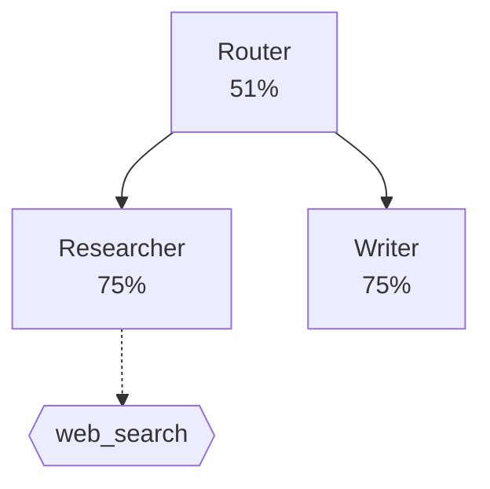

# Golden Path: 60-Second Demo

Run a full EU AI Act trace audit on a committed sample — no API keys, no cloud, no setup beyond `pip install`.

## 1. Install

```bash
pip install ai-trace-auditor
```

## 2. Audit the sample traces

```bash
aitrace audit examples/golden_path/sample_traces.json -o report.md --show-dag
```

That's it. Open `report.md` (or see the committed [sample_report.md](sample_report.md) for what you should get).

## What the sample is

`sample_traces.json` is an OpenTelemetry (GenAI semantic conventions) export of a small multi-agent pipeline: a Router orchestrator delegating to a Researcher (with a web-search tool call) and a Writer, mixing OpenAI and Anthropic models.

## What the audit shows

- **Trace field coverage 86.1%** — 48 requirements satisfied, 14 partial, 5 missing, each with the exact trace field, coverage percentage, and a fix recommendation
- **Article citations** — every check maps to primary text (EU AI Act Articles 12/25, NIST AI RMF, ISO 42001, SOC 2, observability best practices)
- **Per-agent compliance scores** — Article 25 value-chain accountability with bottom-up penalty propagation
- **Execution DAG** — `--show-dag` renders the agent graph as Mermaid:



## Exit codes

`aitrace audit` exits `0` when every checked requirement is satisfied and `1` when gaps are found — so it fails CI builds on compliance regressions by design. The sample intentionally contains gaps (e.g. temperature not logged, missing output capture on one agent), so expect exit code `1`.

## Next steps

```bash
# Audit your own traces (OTel, Langfuse, Claude Code, raw JSONL — format auto-detected)
aitrace audit path/to/your/traces.json

# Scan a codebase and generate Annex IV documentation + data flow maps
aitrace scan path/to/your/project/

# Filter to one regulation
aitrace audit traces.json -r "EU AI Act"
```

> The report is an automated assessment of trace field coverage, not legal advice or a legal compliance determination.
